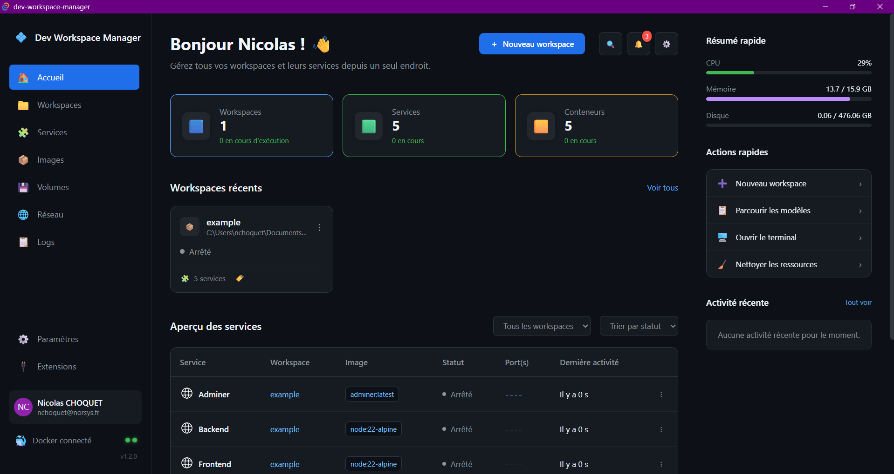
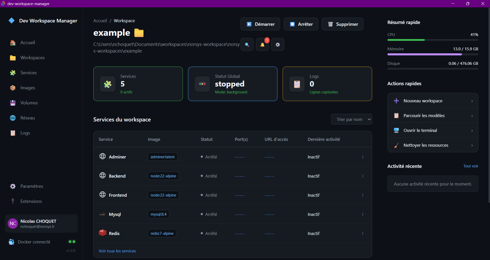
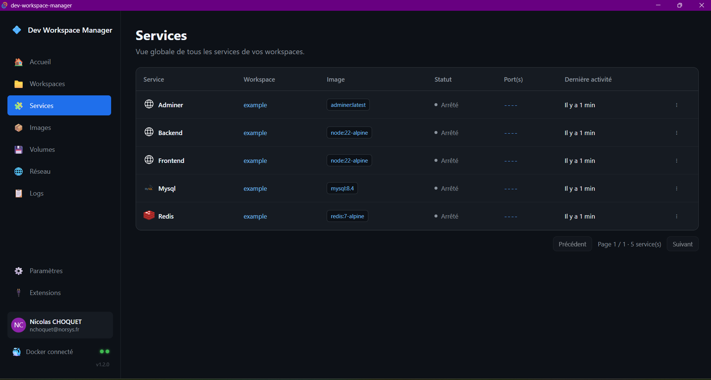
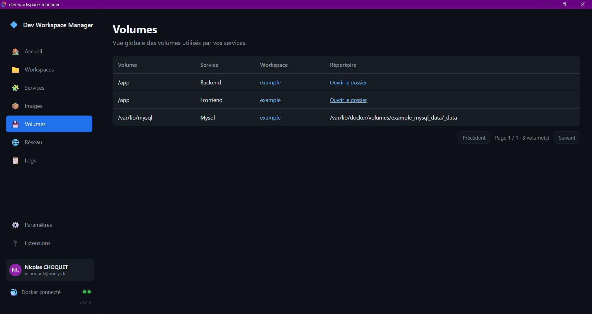

# Dev Workspace Manager

Application de gestion de workspaces type Docker Desktop, permettant la création et la gestion de conteneurs Docker à partir d'un fichier `docker-compose.yaml`.

## Fonctionnalités

- Créer un workspace (à partir du docker-compose.yaml présent dans le répertoire choisis)
- Supprimer un workspace
- Démarrer un workspace (Démarre tous les services associés au workspace)
- Affiche le CPU occupée en temps réel
- Affiche la mémoire RAM occupée en temps réel
- Affiche le stockage occupée par les workspaces enregistrés en temps réel
- Récupère le nom, prénom et email de l'utilisateur système connecté (pro et perso) directement sur la machine.
- Lis en temps réel l'état du daemon docker
- Dans une page associée à un workspace :
  - Liste les services puis affiche en temps réel l'état de chacun d'entre eux ainsi que l'image qui leur est associée
  - Affiche les logs de tous les services en temps réel
  - Affiche l'état globale du workspace
- Dans une page séparée :
  - Liste paginée de tous les services de tous les workspaces avec leur état en temps réel
  - Liste paginée des volumes montés avec un lien permettant d'ouvrir le répertoire dans l'explorateur de fichiers
  - Liste paginée des images utilisées par les services du workspace et propose un lien vers la page associée sur le Docker Hub

## Téléchargement

[Cliquez ici](https://github.com/nicolachoquet06250/norsys-workspaces/releases/latest)

## Aperçu

### Vue accueil

### Vue workspace

### Vue services

### Vue volumes

## Système de mise à jour automatique

Le système d'auto-update a été configuré avec le plugin `@tauri-apps/plugin-updater`.
